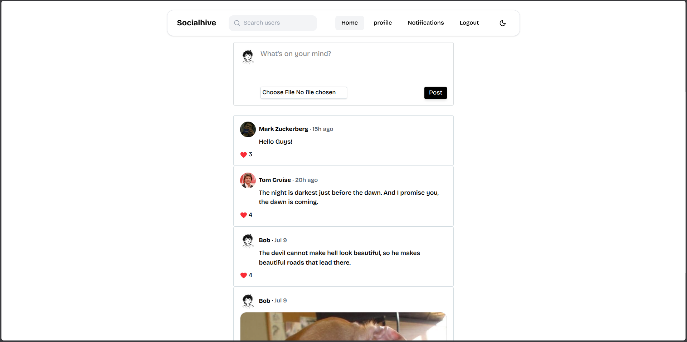
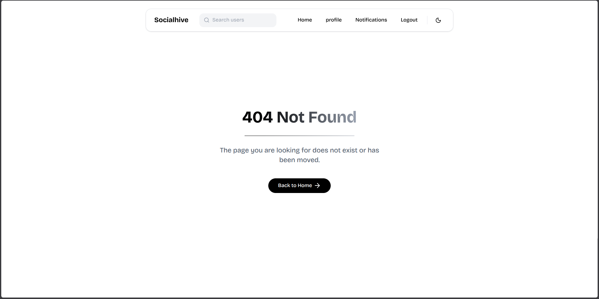

# Socialhive — Image-First Social Media Application

A full-stack social media application inspired by Twitter/X, but designed around **image-based posts**.

I built this project to understand how a real-world application like Twitter/X works — from authentication and API design to database relationships, media uploads, caching, frontend state management, and deployment.

## Installation & Local Setup

### 1. Clone the repository

```bash
git clone https://github.com/mayankbishtx/Socialhive.git
cd Socialhive
```

### 2. Configure environment variables

Create the required `.env` files for both the frontend and backend.

Refer to the `.env.example` files in each directory for the required environment variables.

### 3. Run with Docker

Make sure Docker is installed and running, then execute:

```bash
docker compose up --build
```

Once the containers are running, open the application in your browser:

```text
http://localhost
```

## Run Without Docker

### Start the backend

```bash
cd backend
npm install
npm run dev
```

### Start the frontend

Open a new terminal:

```bash
cd frontend
npm install
npm run dev
```

Then open the local URL shown by Vite in your terminal, typically:

```text
http://localhost:5173
```

## First-Time Usage

After creating an account, your feed will initially be empty. This is expected behavior.

Search for other users, visit their profiles, and follow them. Once you follow users who have shared posts, your feed will begin showing content from those accounts and become personalized based on the people you follow.

## Screenshots



